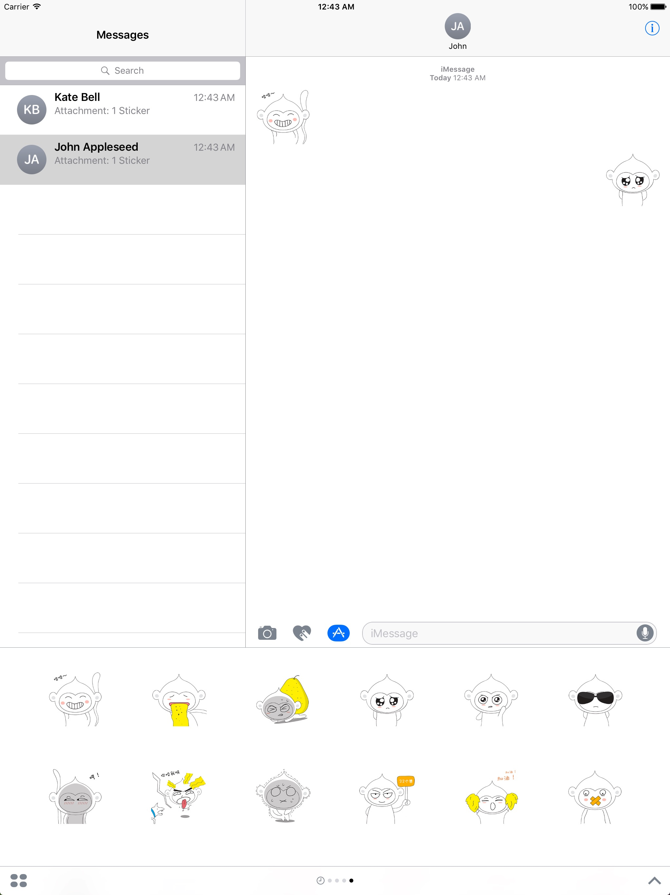

# CodingEmoji

CodingEmoji 是一款表情包应用，在最近更新的 iOS 10 系统中，苹果开放了 iMessage Stickers 的开发，通俗的说法就是我们现在可以为 iMessage 开发表情包了。表情包的开发十分简单，不需要写一行代码，只需要准备好图片资源即可。本示例是一款主要以 Coding 的洋葱猴系列表情为例开发的表情包 App。  

### AppStore

### 开发环境

- XCode 8+

### 运行环境

- iOS 10+

### 详细介绍

参见：[http://www.eyrefree.org/2016/11/24/2016-11-24-Coding-Emoji/](http://www.eyrefree.org/2016/11/24/2016-11-24-Coding-Emoji/)

### 预览

## 作者

EyreFree, eyrefree@eyrefree.org

## 协议

CodingEmoji is available under the MIT license. See the LICENSE file for more info.
